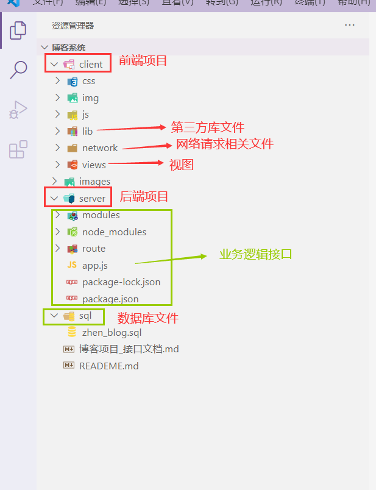
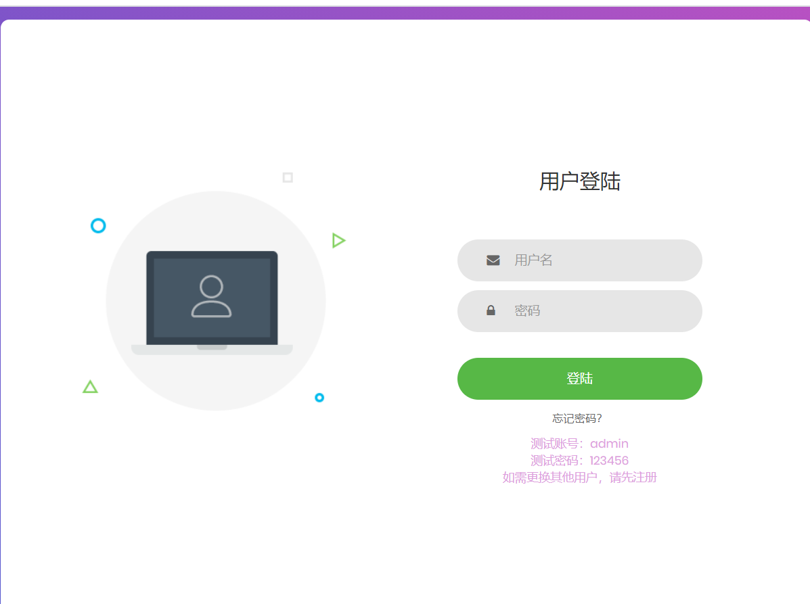
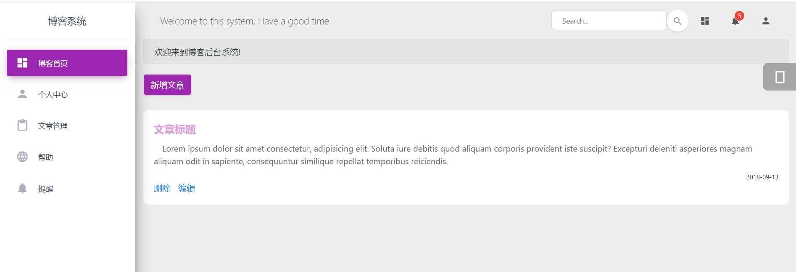
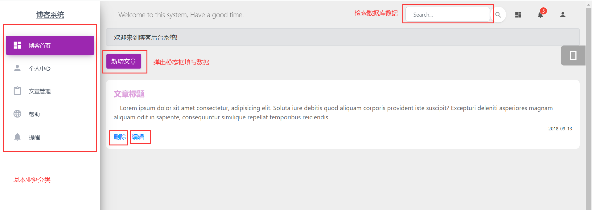

# 博客后台管理系统

## 一、项目概述

### 1.1 简介

前后端分离项目，实现基本的增删该查功能

server：后台项目

client：前台项目

test：postman测试工具

### 1.2 技术选型

- 前端 `JavaScript` `h5+c3` `bootstrap` `jquery`   

- 后端 `Node` `MySQL`  

- 测试 `postman`

    

- 改造基于bootstrap的后台管理系统

    + [Preview](https://demos.creative-tim.com/material-dashboard/examples/dashboard.html)
    + [github地址](https://github.com/creativetimofficial/material-dashboard)

### 1.3 目录结构说明

## 二、项目部署

### 2.1 转储SQL文件

- 开启MySQL服务 将`server -> data`文件夹中的SQL文件运行，导入到数据表中

### 2.2 配置Node后台服务

- 在`server -> modules -> dataBase.js `中 修改MySQL的基本配置

- MySQL：默认账号root 密码123456 数据库test

### 2.3 运行前端项目

- 运行`client/views/login.html`文件
- 进行登录（账号admin 密码123456）或者注册后登录

### 2.4 测试接口

- 使用`postman`软件进行测试

## 四、基本功能

### 4.1 登录注册

### 4.2 主页

### 4.3 基本功能

